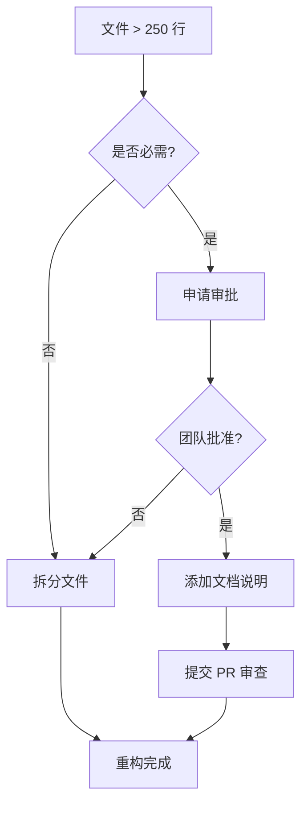

# 代码质量约束规则

> 📅 创建日期：2026-01-29
> 🎯 目标：防止代码质量下降，保持项目健康度

---

## 🔧 强制性约束（提交前必须通过）

### 1. TypeScript 严格模式

```json
// tsconfig.json
{
  "compilerOptions": {
    "strict": true // ✅ 已启用
  }
}
```

### 2. Prettier 代码格式化

```bash
# 格式化检查
npm run format:check

# 自动格式化
npm run format
```

### 3. ESLint 规则

```bash
npm run lint
```

### 4. Pre-commit 钩子

```bash
# 安装 Husky（可选，未来添加）
npm install -D husky
npx husky install
```

---

## 📏 代码规范

### 文件大小限制（严格约束）

| 文件类型 | 最大行数 | 超过限制操作       | ESLint 规则                 |
| -------- | -------- | ------------------ | --------------------------- |
| 页面组件 | 250行    | 禁止提交，必须拆分 | `max-lines: ["error", 250]` |
| 功能组件 | 200行    | 警告，建议拆分     | `max-lines: ["warn", 200]`  |
| UI 组件  | 150行    | 警告，建议拆分     | `max-lines: ["warn", 150]`  |
| 工具函数 | 200行    | 警告，建议拆分     | `max-lines: ["warn", 200]`  |
| 配置文件 | 100行    | 警告，建议拆分     | `max-lines: ["warn", 100]`  |
| Hooks    | 150行    | 警告，建议拆分     | `max-lines: ["warn", 150]`  |

**⚠️ 重要：文件 >300 行需要团队审批才能提交**

#### 当前文件状态（2026-01-29 更新）

| 文件                     | 当前行数 | 状态 | 说明                           |
| ------------------------ | -------- | ---- | ------------------------------ |
| app/page.tsx             | 194      | ✅   | 已拆分 hooks（原 880 行）      |
| LoginSettings.tsx        | 290      | ✅   | 已拆分 3 个标签（原 460 行）   |
| config-panel.tsx         | 57       | ✅   | 已拆分 ConfigForm（原 366 行） |
| components/login/tabs/\* | 50-120   | ✅   | 新拆分的标签组件               |
| components/settings/\*   | 57-330   | ✅   | 配置相关组件                   |

### 大文件治理流程

当文件超过 250 行时，必须执行以下步骤：



**拆分建议：**

1. **页面组件** → 拆分为多个子组件 + hooks
2. **表单组件** → 拆分为控制组件 + UI 组件
3. **列表组件** → 拆分为容器 + 列表项 + hooks
4. **Modal/Dialog** → 拆分为 Content 组件 + hooks

### 复杂度限制

```javascript
// ESLint 规则（.eslintrc.json）
{
  "complexity": ["warn", 15],           // 圈复杂度 ≤ 15
  "max-depth": ["warn", 4],             // 嵌套深度 ≤ 4
  "max-lines-per-function": ["warn", 100], // 单函数 ≤ 100 行
  "max-lines": ["warn", {                // 文件行数限制
    "max": 200,
    "skipBlankLines": true,
    "skipComments": true
  }],
  "max-params": ["warn", 4],            // 函数参数 ≤ 4 个
  "max-statements": ["warn", 30]        // 函数语句数 ≤ 30
}
```

**大文件治理政策：**

- 文件超过 250 行：ESLint 报错，禁止提交
- 文件超过 300 行：需要团队审批 PR
- 文件超过 400 行：自动触发代码审查

### 命名规范

```typescript
// ✅ 正确
interface LoginConfig {}
const DEFAULT_LOGIN_CONFIG: LoginConfig = {};
function getUserById() {}

// ❌ 错误
interface loginConfig {}
const defaultConfig = {};
function get_user_by_id() {}
```

---

## 🚫 禁止事项

### 1. 禁止添加重复代码

```typescript
// ❌ 错误：重复的默认配置
// 在 file1.ts
const DEFAULT_CONFIG = { logo: "🏭️", title: "..." }

// 在 file2.ts
const DEFAULT_CONFIG = { logo: "🏭️", title: "..." }

// ✅ 正确：提取到共享常量
// src/config/login-defaults.ts
export const DEFAULT_LOGIN_CONFIG = { ... }

// 在需要的地方导入
import { DEFAULT_LOGIN_CONFIG } from '@/config/login-defaults'
```

### 2. 禁止创建 `.old`、`.bak` 备份文件

```bash
# ❌ 错误
config-panel.old.tsx
.env.bak

# ✅ 正确：使用 Git 管理
git add .
git commit -m "refactor: update config panel"
```

### 3. 禁止硬编码配置

```typescript
// ❌ 错误
const apiUrl = 'https://api.example.com/v1';

// ✅ 正确：使用环境变量
const apiUrl = process.env.NEXT_PUBLIC_API_URL;
```

### 4. 禁止未使用的导入

```typescript
// ❌ 错误
import { Button, Card, Input } from '@/components/ui'; // Input 未使用

// ✅ 正确
import { Button, Card } from '@/components/ui';
```

---

## 🎯 代码审查清单

### 提交代码前检查

- [ ] 运行 `npm run build` 无错误
- [ ] 运行 `npm run format` 格式化代码
- [ ] 运行 `npm run lint` 无警告
- [ ] 删除所有 `console.log`（保留 `console.error` 和 `console.warn`）
- [ ] 无 `.old`、`.bak`、`.disabled` 文件
- [ ] 所有导入都使用绝对路径（`@/`）
- [ ] **新增文件 <250 行**（否则需要拆分）
- [ ] 新增配置提取到 `src/config/` 目录
- [ ] 复杂逻辑添加注释说明
- [ ] 新增 hooks 放在 `src/hooks/` 目录
- [ ] API 调用逻辑提取到 service 层

---

## 📊 质量监控

### 每周检查项

```bash
# 1. 检查代码行数趋势
find src -name "*.tsx" -o -name "*.ts" | xargs wc -l | sort -n | tail -20

# 2. 检查重复代码
npm install -D jscpd
npx jscpd src/

# 3. 检查依赖安全
npm audit

# 4. 检查类型覆盖率
npx tsc --noEmit
```

---

## 🔄 重构建议

### ✅ 已完成的重构（2026-01-29）

| 文件              | 原行数 | 新行数 | 减少比例 | 拆分方案                               |
| ----------------- | ------ | ------ | -------- | -------------------------------------- |
| app/page.tsx      | 880    | 194    | -78%     | 提取 hooks + task.service.ts           |
| LoginSettings.tsx | 460    | 290    | -37%     | 拆分为 LogoTab, TextTab, BackgroundTab |
| config-panel.tsx  | 366    | 57     | -84%     | 拆分为 ConfigForm.tsx                  |

### 📋 新建文件清单

**自定义 Hooks：**

- `src/hooks/use-brand-config.ts` (44 行) - 品牌配置管理
- `src/hooks/use-image-upload.ts` (70 行) - 图片上传处理
- `src/hooks/use-task-management.ts` (68 行) - 任务状态管理

**服务层：**

- `src/lib/services/task.service.ts` (125 行) - 任务 API 逻辑

**组件拆分：**

- `src/components/login/tabs/LogoTab.tsx` (58 行)
- `src/components/login/tabs/TextTab.tsx` (121 行)
- `src/components/login/tabs/BackgroundTab.tsx` (107 行)
- `src/components/settings/ConfigForm.tsx` (330 行)

---

## 📝 提交信息规范

使用 Conventional Commits：

```bash
# 功能
feat: 添加用户头像上传功能

# 修复
fix: 修复登录页面配置保存失败问题

# 重构
refactor: 提取登录配置为共享常量

# 文档
docs: 更新 README 部署说明

# 样式
style: 统一按钮组件样式

# 测试
test: 添加登录表单验证测试

# 重构
refactor: 拆分 page.tsx 为多个子组件
```

---

## 🛠️ 工具配置

### VSCode 设置（建议）

```json
// .vscode/settings.json
{
  "editor.formatOnSave": true,
  "editor.defaultFormatter": "esbenp.prettier-vscode",
  "typescript.tsdk": "node_modules/typescript/lib",
  "eslint.validate": ["javascript", "typescript", "typescriptreact"]
}
```

### Git 提交钩子（可选）

```bash
# 安装 Husky
npm install -D husky

# 设置 pre-commit 钩子
npx husky install
npx husky add .husky/pre-commit "npm run format && npm run lint"
```

---

## 📚 参考资源

- [TypeScript 最佳实践](https://typescript-eslint.io/rules/)
- [React 代码规范](https://github.com/yannickcr/eslint-plugin-react)
- [Next.js 文档](https://nextjs.org/docs)
- [Conventional Commits](https://www.conventionalcommits.org/)

---

_本文档会随项目演进持续更新_
