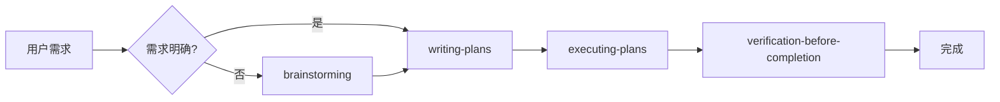
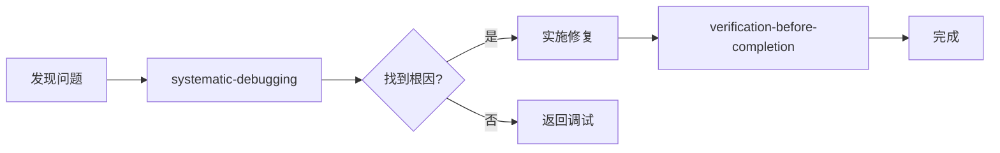
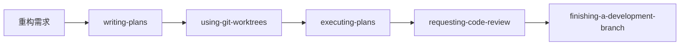
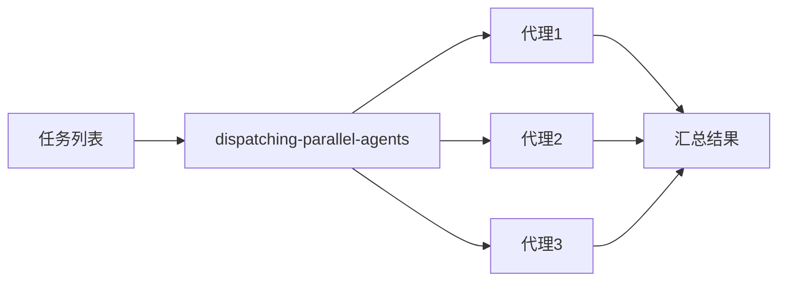
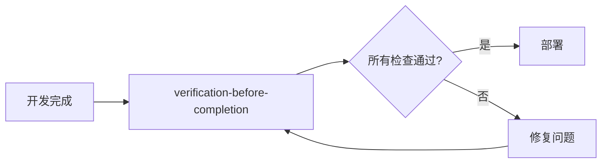

# Superpowers 开发工作流指南

本文档说明如何将 Claude Code 的 **superpowers 技能**与 AI 服装平台的日常开发工作相结合，提高开发效率和代码质量。

---

## 目录

- [核心原则](#核心原则)
- [按场景的技能使用指南](#按场景的技能使用指南)
- [日常开发 SOP](#日常开发-sop)
- [常见问题处理流程](#常见问题处理流程)
- [团队协作规范](#团队协作规范)

---

## 核心原则

### 技能使用规则

1. **主动使用技能**：不要等用户提醒，当识别到适用场景时主动调用
2. **完整执行流程**：每个技能都有完整的流程，不能跳过步骤
3. **验证后再完成**：使用 `verification-before-completion` 确保工作真正完成

### 技能优先级

```
流程技能 > 实现技能
brainstorming > writing-plans > executing-plans
```

---

## 按场景的技能使用指南

### 场景 1: 新功能开发

**适用情况**: 添加新功能、新增模块、重大特性

**技能流程**:



**示例场景**:
- 新增 AI 模型支持
- 添加批量操作功能
- 实现新的生成模式

**关键步骤**:
1. **brainstorming**: 探索用户意图、技术方案、边界情况
2. **writing-plans**: 生成详细实现计划（文件、API、数据模型）
3. **executing-plans**: 按计划执行，有检查点
4. **verification**: 构建、测试、验证功能

---

### 场景 2: Bug 修复

**适用情况**: 测试失败、运行时错误、类型错误

**技能流程**:



**示例场景**:
- TypeScript 类型错误
- API 调用失败
- 状态更新不生效

**关键步骤**:
1. **Phase 1 - 根因分析**:
   - 读取完整错误消息
   - 检查最近变更
   - 找到工作示例对比

2. **Phase 2 - 模式分析**:
   - 找到类似工作代码
   - 对比差异

3. **Phase 3 - 假设与测试**:
   - 单一假设
   - 最小化测试

4. **Phase 4 - 实现**:
   - 创建失败用例
   - 单一修复
   - 验证成功

**实际案例** (2026-01-30 构建错误修复):
```
错误: Type 'string' is not assignable to type 'PromptSource'
根因: CreateTaskInput 中 promptSource 是 string，但 Prisma 期望枚举
修复: 使用 Prisma.TaskUncheckedCreateInput 类型断言
验证: npm run build 成功
```

---

### 场景 3: 复杂重构

**适用情况**: 架构调整、代码迁移、大规模重构

**技能流程**:



**示例场景**:
- 迁移到新状态管理
- API 层重构
- 数据库 schema 变更

**关键步骤**:
1. **writing-plans**: 设计重构方案、风险评估
2. **using-git-worktrees**: 在独立 worktree 工作
3. **executing-plans**: 执行重构
4. **requesting-code-review**: 审查质量
5. **finishing-a-development-branch**: 决定合并策略

---

### 场景 4: 多任务并行

**适用情况**: 多个独立任务可同时进行

**技能流程**:



**示例场景**:
- 同时修复多个文件
- 并行更新文档和代码
- 同时处理前端和后端

**使用方式**:
```
并行任务:
1. 修复 TypeScript 类型错误
2. 更新 API 文档
3. 清理未使用文件

命令: 使用 dispatching-parallel-agents 启动
```

---

### 场景 5: 准备部署

**适用情况**: 开发完成，准备上线

**技能流程**:



**部署前检查清单**:

| 检查项 | 命令 | 成功标准 |
|-------|------|---------|
| 构建成功 | `npm run build` | ✓ Compiled successfully |
| 代码格式化 | `npm run format` | 无错误 |
| Lint 通过 | `npm run lint` | 0 problems |
| 清理日志 | 检查 `console.log` | 仅保留 error/warn |
| 文件大小 | 检查新文件 | < 250 行 |

**环境变量检查**:
```bash
# 本地开发
DATABASE_URL=...          # SQLite 或 PostgreSQL
ACCESS_TOKEN=...          # 访问密码
N8N_WEBHOOK_URL=...       # N8N 工作流

# 生产环境 (Vercel)
DATABASE_URL=...          # Supabase PostgreSQL
FEISHU_APP_ID=...         # 飞书应用
FEISHU_APP_SECRET=...     # 飞书密钥
```

---

## 日常开发 SOP

### 标准工作流程

```
1. 接收任务
   ↓
2. 判断场景 → 选择技能
   ↓
3. 执行技能流程
   ↓
4. 验证完成
   ↓
5. 代码审查 (如需要)
   ↓
6. 合并/部署
```

### 决策树

```
新功能?
├─ 是 → brainstorming → writing-plans → executing-plans
└─ 否
   ├─ Bug?
   │  ├─ 是 → systematic-debugging
   │  └─ 否 → 继续判断
   ├─ 重构?
   │  ├─ 是 → writing-plans → using-git-worktrees
   │  └─ 否 → 继续判断
   └─ 多任务?
      ├─ 是 → dispatching-parallel-agents
      └─ 否 → 直接执行
```

---

## 常见问题处理流程

### 问题 1: 构建失败

**症状**: `npm run build` 报错

**处理流程**:
1. 使用 `systematic-debugging`
2. 读取完整错误消息
3. 定位错误文件和行号
4. 修复类型不匹配
5. 重新构建验证

**常见类型错误**:
- 枚举类型: `string` vs `EnumType`
- 可空类型: `string` vs `string | null`
- JSON 字段: `Record<string, unknown>` vs `Prisma.InputJsonValue`

**修复模式**:
```typescript
// 错误: promptSource: string
data: { ...data }  // ❌

// 正确: 使用类型断言
data: { ...data } as Prisma.TaskUncheckedCreateInput  // ✓
```

---

### 问题 2: 飞书同步失败

**症状**: 飞书记录创建/更新失败

**处理流程**:
1. 使用 `systematic-debugging`
2. 检查 `SyncLog` 表中的错误记录
3. 验证飞书配置 (APP_ID, APP_SECRET)
4. 检查网络连接和 API 权限
5. 测试熔断器状态

**检查命令**:
```bash
curl http://localhost:3000/api/monitoring/circuit-breaker
```

---

### 问题 3: 类型不兼容

**症状**: TypeScript 类型错误

**常见模式**:

| 问题 | 原因 | 解决方案 |
|-----|------|---------|
| `string` 不能赋值给枚举 | 类型定义不匹配 | `as Prisma.EnumType` |
| `unknown` 类型访问属性 | 缺少类型收窄 | `event instanceof Error` |
| JSON 字段类型错误 | Prisma 特殊类型 | `as Prisma.InputJsonValue` |

---

## 团队协作规范

### 代码提交前

1. **运行验证**:
```bash
npm run build    # 构建成功
npm run format   # 格式化代码
npm run lint     # 无 lint 错误
```

2. **移除调试代码**:
- 删除 `console.log` (保留 `console.error`, `console.warn`)
- 移除 `.old`, `.bak`, `.disabled` 文件

3. **文件大小检查**:
- 页面组件: ≤ 250 行
- 功能组件: ≤ 200 行
- UI 组件: ≤ 150 行
- Hooks: ≤ 150 行

### 代码审查时

使用 `requesting-code-review` 技能:
1. 说明变更内容
2. 标注关键修改
3. 附带测试结果
4. 提出审查重点

### 接收审查反馈时

使用 `receiving-code-review` 技能:
1. 理解反馈意图
2. 技术验证建议
3. 不盲目实施
4. 讨论有疑问的部分

---

## 技能快速参考

### brainstorming
**何时使用**: 创建功能、添加组件前的需求探索
**输出**: 用户意图、需求列表、设计建议、边界情况

### systematic-debugging
**何时使用**: 任何 Bug、测试失败、异常行为
**输出**: 根本原因、修复方案、验证步骤

### writing-plans
**何时使用**: 有明确需求的多步骤任务
**输出**: 实现计划、文件列表、API 设计、数据模型

### executing-plans
**何时使用**: 按照已有计划执行
**输出**: 分步实现、检查点验证

### verification-before-completion
**何时使用**: 声称工作完成前
**输出**: 验证命令、测试结果、确认完成

### requesting-code-review
**何时使用**: 完成任务、实现主要功能后
**输出**: 审查请求、变更说明、测试证据

### receiving-code-review
**何时使用**: 收到审查反馈时
**输出**: 理解反馈、技术验证、讨论方案

### dispatching-parallel-agents
**何时使用**: 2+ 个独立任务可同时进行
**输出**: 并行执行、结果汇总

### using-git-worktrees
**何时使用**: 需要隔离工作空间的特性开发
**输出**: 独立 worktree、安全验证

---

## 附录: 项目特定规范

### 类型定义规范

```typescript
// ✅ 正确: 使用 Prisma 类型
import { Prisma } from '@prisma/client';
data: { ...input } as Prisma.TaskUncheckedCreateInput

// ❌ 错误: 直接展开
data: { ...input }  // 类型不匹配
```

### Repository 层规范

```typescript
// ✅ 正确: JSON 字段类型转换
data: {
  ...data,
  responseData: data.responseData as Prisma.InputJsonValue,
}

// ❌ 错误: 直接赋值
data: {
  ...data,  // 类型不兼容
}
```

### Service 层规范

```typescript
// ✅ 正确: 错误处理
try {
  // 操作
} catch (error) {
  console.error('[Service] Failed:', error);
  throw error;
}

// ❌ 错误: 静默失败
try {
  // 操作
} catch {
  // 忽略错误
}
```

---

## 更新日志

| 日期 | 版本 | 变更 |
|-----|------|-----|
| 2026-01-30 | v1.0 | 初始版本，基于 systematic-debugging 实战经验 |
