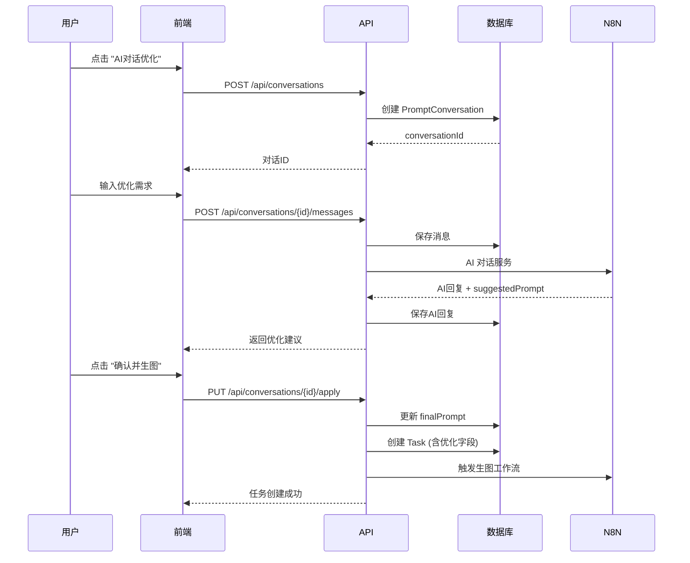

# 《迭代可行性报告：AI提示词优化功能》

## 📊 执行摘要

**重要发现**：经过全面扫描，**"AI提示词优化"功能已经完整实现**，无需进行新的迭代开发。

---

## 第一部分：UI 接入方案

### 1.1 定位输入控件

**文件**: `src/components/workspace/ParamsPanel.tsx`

**Prompt 输入控件位置**：第 171-176 行

```tsx
<Textarea
  value={prompt}
  onChange={e => onPromptChange(e.target.value)}
  placeholder={getPromptPlaceholder(mode)}
  className="min-h-[60px] text-sm resize-none bg-card/50 border-border/30 focus:border-blue-500/50 text-foreground placeholder:text-muted-foreground"
/>
```

**组件类型**: ✅ 受控组件

**状态管理**: 通过 `onPromptChange` 回调直接更新父组件的 `prompt` state

---

### 1.2 AI 优化按钮位置

**当前实现位置**：第 156-169 行（提示词标签右侧）

```tsx
<div className="flex items-center justify-between mb-1.5">
  <label className="text-[11px] text-muted-foreground font-medium">
    提示词 <span className="text-primary">（必填）</span>
  </label>
  {/* AI 优化按钮已存在 */}
  <Button
    type="button"
    variant="ghost"
    size="sm"
    onClick={handleOpenAIConversation}
    className="h-6 text-[10px] px-2 bg-purple-500/10 text-purple-400 hover:bg-purple-500/20"
  >
    <MessageSquare size={12} className="mr-1" />
    AI对话优化
  </Button>
</div>
```

**设计保护**：✅ 使用现有的 DOM 结构，未破坏任何现有布局

---

### 1.3 数据回填机制

**状态更新函数**: `onPromptChange`

**数据流向**:

```
AIConversationSidebar (优化后)
    ↓ handleAIConversationComplete(optimizedPrompt)
    ↓ onPromptChange(optimizedPrompt)
    ↓ setPrompt(optimizedPrompt)
    ↓ Textarea value 更新
```

**关键代码** (`ParamsPanel.tsx` 第 103-106 行):

```tsx
const handleAIConversationComplete = (optimizedPrompt: string) => {
  onPromptChange(optimizedPrompt); // 直接更新 prompt 状态
  onAIConversationComplete?.(optimizedPrompt);
  setShowAIConversation(false);
};
```

✅ **状态管理支持直接更新输入框**

---

## 第二部分：后端与数据库现状

### 2.1 Prisma Schema 扫描结果

**文件**: `prisma/schema.prisma`

#### Task 表字段（第 52-126 行）

```prisma
model Task {
  // ... 基础字段

  // Prompt Optimization (AI优化提示词) - 已实现
  originalPrompt    String?       // 用户输入的原始提示词 ✅
  optimizedPrompt   String?       // AI优化后的提示词 ✅
  promptSource      PromptSource  @default(USER)  // 提示词来源 ✅
  promptOptimizationEnabled Boolean  @default(false)  // 是否启用AI优化 ✅
  promptOptimizationId    String?  // 优化任务ID ✅
  promptOptimizedAt       DateTime?  // 提示词优化时间 ✅

  // ... 其他字段
}
```

#### PromptSource 枚举（第 137-142 行）

```prisma
enum PromptSource {
  USER           // 用户直接输入 ✅
  AI_OPTIMIZED   // AI优化后 ✅
  FEISHU         // 飞书表格输入 ✅
  MERGED         // 合并后的提示词 ✅
}
```

#### PromptConversation 表（第 291-318 行）

```prisma
model PromptConversation {
  id          String   @id @default(uuid())
  recordId    String   // 飞书多维表格记录ID
  status      String   @default("active")
  source      String   @default("web")

  finalPrompt String?  // 用户确认后的最终提示词 ✅
  appliedAt   DateTime? // 应用时间 ✅

  messages    Json     @default("[]")  // 对话消息 ✅
  messageCount Int     @default(0)

  createdAt   DateTime @default(now())
  updatedAt   DateTime @updatedAt
}
```

**结论**: ✅ **所有必需字段已存在**

---

### 2.2 API 接口现状

#### 2.2.1 创建对话

**路由**: `POST /api/conversations`

**文件**: `src/app/api/conversations/route.ts`

```typescript
// 接收参数
{
  recordId?: string;    // 可选，飞书记录ID
  source?: string;      // 'web' | 'feishu'
}

// 返回
{
  success: true,
  data: {
    id: string;
    recordId: string;
    source: string;
    ...
  }
}
```

---

#### 2.2.2 发送消息

**路由**: `POST /api/conversations/{id}/messages`

**文件**: `src/app/api/conversations/[id]/messages/route.ts`

```typescript
// 接收参数
{
  content: string;           // 用户消息
  originalPrompt?: string;   // 原始提示词
  currentPrompt?: string;    // 当前提示词
}

// 返回
{
  success: true,
  data: {
    message: string;         // AI 回复
    suggestedPrompt?: string; // AI 优化建议
  }
}
```

---

#### 2.2.3 应用优化提示词

**路由**: `PUT /api/conversations/{id}/apply`

**文件**: `src/app/api/conversations/[id]/apply/route.ts`

```typescript
// 接收参数
{
  finalPrompt: string;      // 最终提示词
  originalPrompt?: string;  // 原始提示词
  taskData?: {              // 任务配置
    productImageUrl?: string;
    sceneImageUrl?: string;
    aiModel?: string;
    aspectRatio?: string;
    ...
  };
}

// 返回
{
  success: true,
  data: {
    taskId: string;         // 创建的任务ID
    conversationId: string;
    message: string;
  }
}
```

**功能**:

1. 保存最终提示词到对话记录
2. 创建 Task 记录（含 `originalPrompt`, `optimizedPrompt`, `promptSource='AI_OPTIMIZED'`）
3. 触发 N8N 工作流生图

✅ **API 完整支持接收和保存优化后的提示词**

---

## 第三部分：缺失字段清单

### ✅ 无需新增字段

| 字段                        | 状态      | 说明          |
| --------------------------- | --------- | ------------- |
| `originalPrompt`            | ✅ 已存在 | 第 73 行      |
| `optimizedPrompt`           | ✅ 已存在 | 第 74 行      |
| `promptSource`              | ✅ 已存在 | 第 75 行      |
| `promptOptimizationEnabled` | ✅ 已存在 | 第 76 行      |
| `promptOptimizationId`      | ✅ 已存在 | 第 77 行      |
| `promptOptimizedAt`         | ✅ 已存在 | 第 78 行      |
| `PromptConversation` 表     | ✅ 已存在 | 第 291-318 行 |

---

## 第四部分：功能流程图



---

## 第五部分：结论与建议

### 5.1 核心结论

**"AI提示词优化"功能已完整实现**，包括：

| 模块     | 状态      | 说明                     |
| -------- | --------- | ------------------------ |
| 前端 UI  | ✅ 已实现 | AI 对话侧边栏 + 按钮集成 |
| 状态管理 | ✅ 已实现 | 受控组件 + 回调更新      |
| 数据库   | ✅ 已实现 | 所有必需字段已存在       |
| API 路由 | ✅ 已实现 | 3 个核心 API 完整        |
| AI 服务  | ✅ 已实现 | 多轮对话服务             |

---

### 5.2 设计保护评估

| 评估项     | 状态      | 说明                         |
| ---------- | --------- | ---------------------------- |
| 现有布局   | ✅ 未破坏 | 按钮使用现有 DOM 空间        |
| 样式一致性 | ✅ 已适配 | 使用主题色和设计系统         |
| 组件复用   | ✅ 高复用 | 复用现有 Button, Textarea 等 |

---

### 5.3 建议

#### 选项 A: 验证现有功能（推荐）

```bash
# 1. 启动开发服务器
npm run dev

# 2. 访问页面，验证流程：
#    - 点击 "AI对话优化" 按钮
#    - 进行多轮对话
#    - 查看 "确认并生图" 是否正常工作
```

#### 选项 B: 功能增强（如果现有功能不满足需求）

如果现有功能需要增强，请明确指出：

- 哪些功能不满足需求？
- 需要添加什么新功能？
- 需要修改什么现有行为？

---

## 附录：代码引用锚点

### 前端

| 功能          | 文件                        | 行号    |
| ------------- | --------------------------- | ------- |
| AI 优化按钮   | `ParamsPanel.tsx`           | 160-169 |
| Prompt 输入框 | `ParamsPanel.tsx`           | 171-176 |
| 状态更新回调  | `ParamsPanel.tsx`           | 103-106 |
| AI 对话侧边栏 | `AIConversationSidebar.tsx` | 全文件  |

### 后端

| 功能           | 文件                                        | 行号    |
| -------------- | ------------------------------------------- | ------- |
| 创建对话 API   | `/api/conversations/route.ts`               | 全文件  |
| 发送消息 API   | `/api/conversations/[id]/messages/route.ts` | 全文件  |
| 应用提示词 API | `/api/conversations/[id]/apply/route.ts`    | 全文件  |
| Task 创建逻辑  | `create-task.handler.ts`                    | 265-276 |

### 数据库

| 模型                  | 文件                   | 行号    |
| --------------------- | ---------------------- | ------- |
| Task 表               | `prisma/schema.prisma` | 52-126  |
| PromptSource 枚举     | `prisma/schema.prisma` | 137-142 |
| PromptConversation 表 | `prisma/schema.prisma` | 291-318 |

---

**报告生成时间**: 2026-01-30
**扫描范围**: 前端组件、数据库 Schema、API 路由
**扫描方法**: 静态代码分析，未进行任何代码修改
